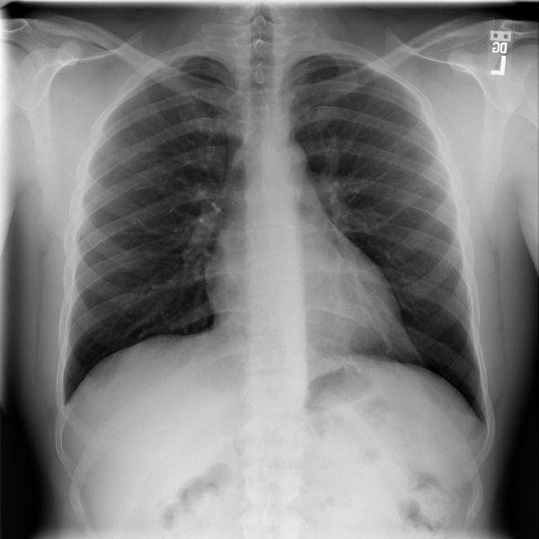
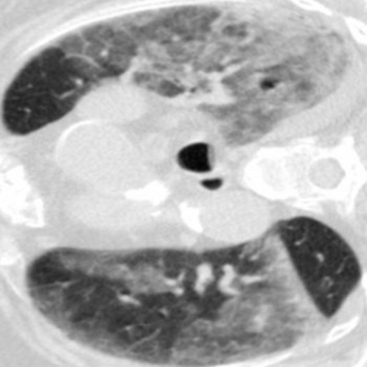
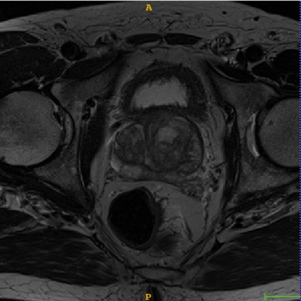
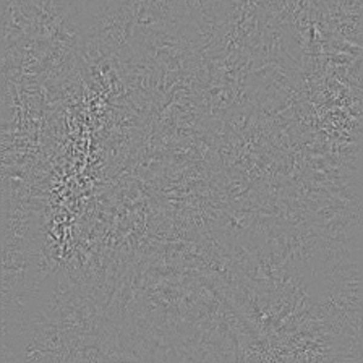
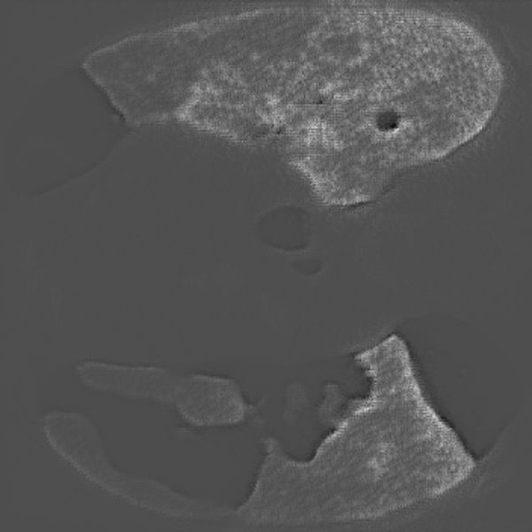
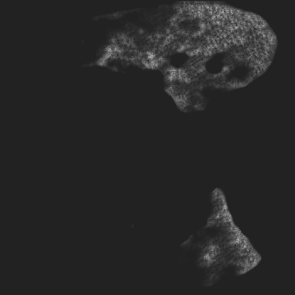
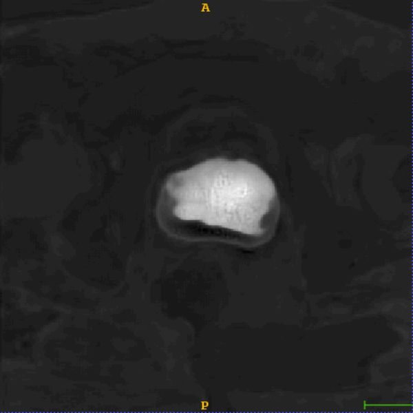
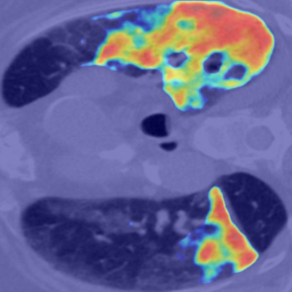

# M3d-CAM
[](LICENSE)
[](https://meclabtuda.github.io/M3d-Cam/)
[](https://badge.fury.io/py/medcam) 
[](https://anaconda.org/conda-forge/medcam) 

[](https://colab.research.google.com/drive/14XXonVYDFrfLd27kKx03nhxJaIfZR9cR?usp=sharing)

M3d-CAM is an easy to use PyTorch library that allows the generation of **3D/ 2D attention maps** for both **classification and segmentation** with multiple methods such as Guided Backpropagation, 
Grad-Cam, Guided Grad-Cam and Grad-Cam++. <br/> 
All you need to add to your project is a **single line of code**: <br/> 
```python
model = medcam.inject(model, output_dir="attention_maps", save_maps=True)
```

## Features

* Works with classification and segmentation data / models
* Works with 2D and 3D data
* Supports Guided Backpropagation, Grad-Cam, Guided Grad-Cam and Grad-Cam++
* Attention map evaluation with given ground truth masks
* Option for automatic layer selection

## Installation
* Install PyTorch from https://pytorch.org/get-started/locally/
* Install M3d-CAM via pip with: `pip install medcam`
* Install M3d-CAM via conda with: `conda install -c conda-forge medcam`

## Documentation
M3d-CAM is fully documented and you can view the documentation under: <br/> 
https://meclabtuda.github.io/M3d-Cam/

## Examples

|                                            |                #1 Classification (2D)                 |                  #2 Segmentation (2D)                 |                       #3 Segmentation (3D)            |
| :----------------------------------------: | :---------------------------------------------------: | :---------------------------------------------------: | :---------------------------------------------------: |
|                  Image                     |                |                  |                  |
|          Guided backpropagation            |                  |                    |                    |
|                 Grad-Cam                   |                 |                   |                   |
|              Guided Grad-Cam               |                |                  |                  |
|               Grad-Cam++                   |               |                 |                 |

## Usage

```python
# Import M3d-CAM
from medcam import medcam

# Init your model and dataloader
model = MyCNN()
data_loader = DataLoader(dataset, batch_size=1, shuffle=False)

# Inject model with M3d-CAM
model = medcam.inject(model, output_dir="attention_maps", save_maps=True)

# Continue to do what you're doing...
# In this case inference on some new data
model.eval()
for batch in data_loader:
    # Every time forward is called, attention maps will be generated and saved in the directory "attention_maps"
    output = model(batch)
    # more of your code...
```

## Demos

### Classification
You can find a Jupyter Notebook on how to use M3d-CAM for classification using a resnet152 at `demos/Medcam_classification_demo.ipynb` or open it directly in Google Colab: [](https://colab.research.google.com/drive/14XXonVYDFrfLd27kKx03nhxJaIfZR9cR?usp=sharing)

### 2D Segmentation
TODO

### 3D Segmentation
You can find a Jupyter Notebook on how to use M3d-CAM with the nnUNet for handeling 3D data at `demos/Medcam_nnUNet_demo.ipynb` or open it directly in Google Colab: [](https://colab.research.google.com/drive/1b6LMbSM3dvpCS4jEsWVpmgTbsR_rVPUF?usp=sharing)


## Citations
If you are using M3D-CAM for your article, please consider citing this tech report and the following papers:
```
@misc{2007.00453,
Author = {Karol Gotkowski and Camila Gonzalez and Andreas Bucher and Anirban Mukhopadhyay},
Title = {M3d-CAM: A PyTorch library to generate 3D data attention maps for medical deep learning},
Year = {2020},
Eprint = {arXiv:2007.00453},
}
```

```
@inproceedings{selvaraju2017grad,
  title={Grad-cam: Visual explanations from deep networks via gradient-based localization},
  author={Selvaraju, Ramprasaath R and Cogswell, Michael and Das, Abhishek and Vedantam, Ramakrishna and Parikh, Devi and Batra, Dhruv},
  booktitle={Proceedings of the IEEE international conference on computer vision},
  pages={618--626},
  year={2017}
}
```

```
@inproceedings{chattopadhay2018grad,
  title={Grad-cam++: Generalized gradient-based visual explanations for deep convolutional networks},
  author={Chattopadhay, Aditya and Sarkar, Anirban and Howlader, Prantik and Balasubramanian, Vineeth N},
  booktitle={2018 IEEE Winter Conference on Applications of Computer Vision (WACV)},
  pages={839--847},
  year={2018},
  organization={IEEE}
}
```