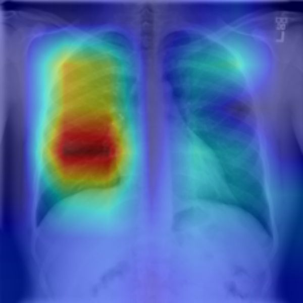

# M3d-CAM
[](LICENSE)
[](https://M3d-Cam.github.io/M3d-CAM)
[](https://badge.fury.io/py/medcam)


M3d-CAM is an easy to use Pytorch library that makes model predictions more interpretable for humans. 
It allows the generation of attention maps with multiple methods like Guided Backpropagation, 
Grad-Cam, Guided Grad-Cam and Grad-Cam++. <br/> 
All you need to add to your project is a **single line of code**: <br/> 
```python
model = medcam.inject(model, output_dir="attention_maps", save_maps=True)
```

## Features

* Works with classification and segmentation data / models
* Works with 2D and 3D data
* Supports Guided Backpropagation, Grad-Cam, Guided Grad-Cam and Grad-Cam++
* Attention map evaluation with given ground truth masks
* Option for automatic layer selection

## Installation
* Install Pytorch from https://pytorch.org/get-started/locally/
* Install M3d-CAM via pip with: `pip install medcam`

## Documentation
M3d-CAM is fully documented and you can view the documentation under: <br/> 
https://???.github.io/M3d-CAM

## Examples

|                                            |                #1 Classification (2D)                 |                  #2 Segmentation (2D)                 |                       #3 Segmentation (3D)            |
| :----------------------------------------: | :---------------------------------------------------: | :---------------------------------------------------: | :---------------------------------------------------: |
|                  Image                     |                |                  |                  |
|          Guided backpropagation            |                  |                    |                    |
|                 Grad-Cam                   |                 |                   |                   |
|              Guided Grad-Cam               |                |                  |                  |
|               Grad-Cam++                   |               |                 |                 |

## Usage

```python
# Import M3d-CAM
from medcam import medcam

# Init your model and dataloader
model = MyCNN()
data_loader = DataLoader(dataset, batch_size=1, shuffle=False)

# Inject model with M3d-CAM
model = medcam.inject(model, output_dir="attention_maps", save_maps=True)

# Continue to do what you're doing...
# In this case inference on some new data
model.eval()
for batch in data_loader:
    # Every time forward is called, attention maps will be generated and saved in the directory "attention_maps"
    output = model(batch)
    # more of your code...
```

## Demos

### Classification
You can find a Jupyter Notebook on how to use M3d-CAM for classification using a resnet152 at `demos/Medcam_classification_demo.ipynb`.

### 2D Segmentation
TODO

### 3D Segmentation
You can find a Jupyter Notebook on how to use M3d-CAM with the nnUNet for handeling 3D data at `demos/Medcam_nnUNet_demo.ipynb`.
